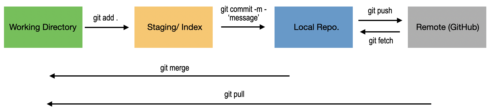

git cheat-sheet: https://git-scm.com/cheat-sheet

## Configuration:

- git config --global user.name "Your Name" # Set global user name
- git config --global user.email "your email" # Set global user email
- git config --global color.ui auto # Enable colored Git output

## Starting a Project:
- git init [project-name] # Create a new local repository
- git clone [repository-url] # Clone a remote repository

## Making and Storing Changes:

- git status # Show modified files, staged files, and untracked files
- git add [file] # Stage a specific file for commit
- git add . # Stage all changes in the current directory
- git rm [file] # Remove a file from working directory and staging area
- git commit -m "Commit message" # Commit staged changes with a message
- git commit --amend # Amend the last commit
- git stash # Temporarily save changes in the working directory
- git stash apply # Restore stashed changes
-git stash drop # Delete a specific stash

## Inspecting History:

- git log # Display commit history
- git log --oneline # Display condensed commit history
- git diff # Show changes between working directory and staging area
- git diff [commit1] [commit2] # Show changes between two commits

## Remote Operations:

- git remote add origin [repository-url] # Add a remote repository
- git fetch origin # Fetch updates from the remote repository
- git pull origin [branch-name] # Fetch and merge updates from a remote branch
- git push origin [branch-name] # Push local changes to a remote branch

## Branching and Merging:

- git branch # List local branches
- git branch -a # List all branches (local and remote)
- git branch [branch-name] # Create a new branch
- git checkout [branch-name] # Switch to an existing branch
- git checkout -b [new-branch-name] # Create and switch to a new branch
- git merge [branch-name] # Merge a branch into the current branch
- git branch -d [branch-name] # Delete a local branch

